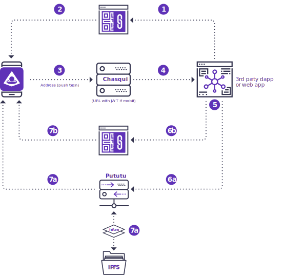

# Attesting Credentials



 * **If the user consents, the uPort app saves the attestation token to their device.*

<div class="overview-list" markdown=1>

1. Browser displays a QR code (if desktop) or loads a URI that opens the uPort app (if mobile) to initiate the login / share data flow outlined in [requesting credentials](/requestcredentials)
1. After the user scans (on desktop) or consents to open the app (on mobile), the app displays a card asking the user to share their data. This will always contain the user’s address and may contain a push token as well as any other data the app chooses to request.
1. If user consents, mobile app posts the address (and maybe also a push token or other data) via Chasqui (if desktop) or encoded in a JWT appended to a URI (if mobile)
1. Browser grabs the address & data from Chasqui or the URL and removes QR code from UI.
1. When the app is ready to send an attestation (maybe they completed a background check, maybe the user sent funds, maybe the user shared a piece of personal data), the app encodes the relevant data in a JWT and signs it.

</div>
<hr>

###### If push is enabled

<div class="overview-list1" markdown=1>

- This attestation token is sent along with the user’s push token to pututu,
- Pututu checks the signature in the push token against the user’s public key in IPFS, then forwards the attestation token.
- The user receives a push notification, which opens the app to a card asking if they want to accept the attestation.

</div>
<hr>

###### If push is not enabled

<div class="overview-list2" markdown=1>

- The attestation token is encoded in a QR code (if desktop) or a URI (if mobile) and the user is told to scan or open the uPort app.
- After the user scans (desktop) or consents to open the app (mobile), the app displays a card asking if the user wants to accept the attestation

</div>
<hr>

One of the core needs of Web 3.0 is to build trust in a self-sovereign world. We establish facts which are not mathematically derived by social consensus. To create social consensus, actors must attest to things being true. We can do this with uPort using the `uport.attestCredentials` function.

**NOTE:** Currently only one credential can be pushed at a time. We are working to fix this soon.

## Calling the attest method

```js
uport.attestCredentials({
  sub: 'THE_RECEIVING_UPORT_ID',
  claim: { CUSTOM_PROPERTY: PROPERTY_VALUE },
})
```

## Setting an expiration date

We can also optionally add an expiration date.

```js
uport.attestCredentials({
  sub: 'THE_RECEIVING_UPORT_ID',
  claim: { CUSTOM_PROPERTY: PROPERTY_VALUE },
  exp: new Date().getTime() + 30 * 24 * 60 * 60 * 1000,  // Optional expiration
})
```

## Attesting multiple credentials

**Under construction**
