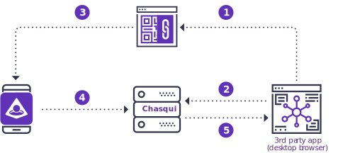
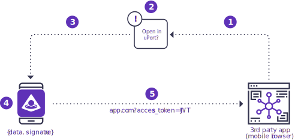

# Requesting Credentials

The first and most basic step you should take is to allow your user to connect their uPort to your app. Uport-connect's `requestCredentials` method is how you accomplish this, similar in concept to logging in , except there is no server session for you to manage. All you need to do to "connect" is to disclose the requested credentials you have in your uPort identity.



### Desktop web

<div class="overview-list" markdown=1>

1. Browser displays QR code with URI
1. Browser starts polling chasqui using the sessionId to check if Mobile has posted the address & any other info required by the 3rd party app.
1. Mobile scans QR code, displays card asking the user to share their address (and, optionally, other relevant data)
1. If user consents: Mobile grabs sessionId from URI, posts address & data to the Chasqui API using the sessionId
1. Browser grabs the address & data from Chasqui, removes QR code from UI

</div>



### Mobile web

<div class="overview-list" markdown=1>

1. Browser opens URL from the QR
1. An alert is shown to the user asking if they want to open in the uPort app
1. If user agrees, uPort app opens and displays card asking the user to share their address or other data (e.g., push token, attestation)
1. If user agrees, uPort app creates a JWT that includes the requested data and signs it with the device key.
1. Mobile browser is opened and an access_token field is appended to the URL. The access_token field contains the signed JWT.
1. Mobile browser grabs the access_token JWT from the URL and extracts the iss (issuer) field which contains the uPort identity (address) & other requested data

</div>

## Calling the request method

**By default** the `uport-connect` library will fire a QR image inside of an injected global modal to help you get up and running quickly.

**This can be disabled** by intercepting the URI so you may use another library to customize the look and feel of the QR image. See [Custom QR Styling](#custom-qr-styling)

Once the user has scanned the displayed QR image, and has submitted their credentials, the promise should resolve with a Schema.org person JSON data payload. You can then handle this data however you desire in the then function.

```js
// Basic usage with modal injection
uport.requestCredentials()
     .then((userProfile) => {
       // Do something after they have disclosed credentials
})
```

The expected payload should look like:

```js
{
  "@context":"http://schema.org",
  "@type":"Person",
  "name":"Agent Smith",
  "address":"23fga3r2hh87ddhq98dhas8dz101j9f449w0",
  "avatar": {
    "uri": "https://ipfs.infura.io/ipfs/QmaqGAeHmwAi44T6ZrSuu3yxwiyHPxoE1rHGmKxeCuZbS7DBX"
  },
  "country": "US"
  "network":"rinkeby",
  "publicEncKey": "dgH1devHn5MhAcph+np8MI4ZLB2kJWqRc4NTwtAj6Fs="
  "publicKey":"0x04016751595cf2f1429367d6c83a826526g613b4f7574af55ded0364f0fb34600bceba9211e5864ae616d7e83b5e3c79f1c913b40c8d38c64952fef383fd3ad637",
}
```

## Requesting specific credentials

You can request specific credentials by submitting an array of values in an array of the `requested` key of a passed object.

```js
uport.requestCredentials({
  requested: ['name', 'avatar', 'phone', 'country'],
  }).then((userProfile) => {
    // Do something after they have disclosed credentials
})
```

## Enabling Push Notifications

When a transaction is going to be signed, if the `notifications` flag is set to `true` **it will allow any future transaction signing to fire a prompt in the uPort mobile app.** For UX considerations, we encourage developers to use this, otherwise your users will have to scan a QR code per each interaction.

```js
uport.requestCredentials({
  requested: ['name', 'avatar', 'phone', 'country'],
  notifcations: true
  }).then((userProfile) => {
    // Do something after they have disclosed credentials
})
```

## Custom QR Styling (web)

We have had success with the [KJUA QR Library](https://larsjung.de/kjua/). It's also recommended you wrap the QR or create a seperate button for mobile.

```js
uport.requestCredentials({
  requested: ['name', 'avatar', 'phone', 'country'],
  notifcations: true },
  (uri) => {

    const qr = kjua({
      text: uri,
      fill: '#000000',
      size: 400,
      back: 'rgba(255,255,255,1)'
    })

    // Create wrapping link for mobile touch
    let aTag = document.createElement('a')
    aTag.href = uri

    // Nest QR in <a> and inject
    aTag.appendChild(qr)
    document.querySelector('#kqr').appendChild(aTag)
  }
  }).then((userProfile) => {
    // Do something after they have disclosed credentials
})
```

## Logging in via Mobile (sdk)

**Under construction**
