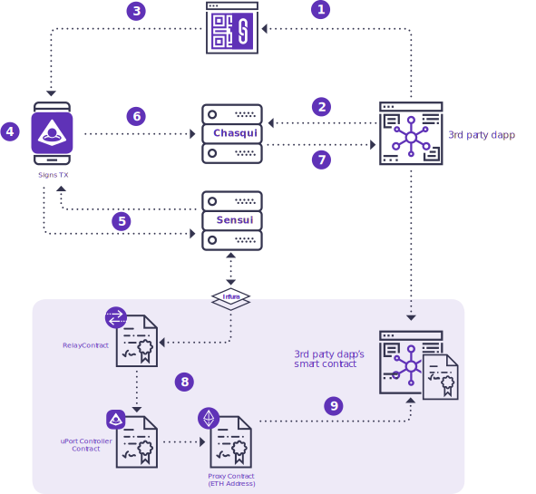

<style type="text/css">

  li {
    font-size: 16px;
  }

  .overview-list {
      margin-left: 0;
      padding-right: 0;
      list-style-type: none;
  }

  .overview-list li {
      counter-increment: list-counter;
      list-style: inside;
  }

  .overview-list li::before {
      content: counter(list-counter);
      /* margin-right: 5px; */
      /* font-size: 80%; */
      background-color: #7958d8;
      color: #f9f9fa;
      font-weight: bold;
      font-size: .9em;
      padding: 2px 5px;
      border-radius: 15px;
      display: inline-block;
      width: 1em;
      margin-left: -1.8em;
      margin-top: .4em;
      margin-right: .3em;
      text-align: center;
      direction: rtl;
  }

  .overview-list1 ol {
      counter-increment: list-counter1 5;
  }

  .overview-list1 li {
      counter-increment: list-counter1;
      list-style: inside;
  }

  .overview-list1 li::before {
      content: counter(list-counter1) "a";
      /* margin-right: 5px; */
      background-color: #7958d8;
      color: #f9f9fa;
      font-weight: bold;
      font-size: .9em;
      padding: 2px 5px;
      border-radius: 15px;
      display: inline-block;
      width: 1em;
      margin-left: -1.8em;
      margin-top: .4em;
      margin-right: .3em;
      text-align: center;
      direction: rtl;
  }

  .overview-list2 ol {
      counter-increment: list-counter2 5;
  }

  .overview-list2 li {
      counter-increment: list-counter2;
      list-style: inside;
  }

  .overview-list2 li::before {
      content: counter(list-counter2) "b";
      /* margin-right: 5px; */
      /* font-size: 80%; */
      background-color: #7958d8;
      color: #f9f9fa;
      font-weight: bold;
      font-size: .9em;
      padding: 2px 5px;
      border-radius: 15px;
      display: inline-block;
      width: 1em;
      margin-left: -1.8em;
      margin-top: .4em;
      margin-right: .3em;
      text-align: center;
      direction: rtl;
  }

  .overview-list3 ol {
      counter-increment: list-counter3 8;
  }

  .overview-list3 li {
      counter-increment: list-counter3;
      list-style: inside;
  }

  .overview-list3 li::before {
      content: counter(list-counter3);
      /* margin-right: 5px; */
      /* font-size: 80%; */
      background-color: #7958d8;
      color: #f9f9fa;
      font-weight: bold;
      font-size: .9em;
      padding: 2px 5px;
      border-radius: 15px;
      display: inline-block;
      width: 1em;
      margin-left: -1.8em;
      margin-top: .4em;
      margin-right: .3em;
      text-align: center;
      direction: rtl;
  }

  table {
    table-layout: fixed;
    width: 100%;
  }

  td {
    align: left;
  }

  .overview-list p {
    font-size: .9em;
  }

  img[alt="small-diag"] {
    padding: 20px;
    margin-left: auto;
    margin-right: auto;
    max-width: 550px;
    display: block;
  }

  img[alt="diag"] {
    padding: 20px;
    margin-left: auto;
    margin-right: auto;
    display: block;
    max-width: 600px;
  }

  hr {
    border: 0;
    height: 0;
    color: rgba(230, 224, 248);
    background-color: rgba(230, 224, 248);
    border-color: rgba(230, 224, 248);
    border-top: 1px solid;
  }

</style>


# Signing Transactions

## Ask User to Sign Tx

<div class="overview-list" markdown=1>

1. Browser displays QR code with randomly generated sessionID in a URI
1. Browser starts polling chasqui using the sessionId to check if Mobile has posted the transaction hash.
1. If mobile-to-mobile, this follows the mobile interaction pattern (using URIs & JWTs instead of Chasqui shown in diagram A)
1. Mobile scans QR code, displays card asking the user to sign a transaction. A system dialog (Touch ID / Face ID / Device PIN) is shown in order to access the device key.
1. If user consents: Mobile fetches the transaction data from the URL, as well as the sessionId, then signs the transaction data with the device key.
1. Device sends the signed tx to sensui.uport.me. Sensui wraps the signed tx in its own transaction and sends the wrapped tx to a relay contract via rinkeby.infura.io.
1. Infura sends the tx hash back to Sensui, which passes it to the mobile app. Mobile posts the transaction hash to chasqui using the sessionId.
1. Browser grabs the transaction hash from Chasqui, removes QR code from UI, and updates UI accordingly
1. The relay contract confirms the original signed tx hasn’t been tampered with, then forwards the entire wrapped tx through the controller contract to the proxy.
1. Proxy contract forwards the tx to its intended destination, gas paid for by Sensui.

</div>



uPort comes pre-baked with a web3 instance that calls to [Infura](https://github.com/ethereumjs/testrpc), our p2p swarm of nodes we have built so you don't need to stand up your own. All you need to do is grab our `web3` object and instantiate a smart contract javascript object with a **provided ABI**.

## Supply the contract ABI

An ABI (Application BINARY Interface) can be generated by compiling your smart contract with the [Remix](https://ethereum.github.io/browser-solidity/) Web IDE. Its on the "Contracts" tab down where it says `interface`. You can deploy this contract to the chain with the **Web3** deploy code just below that in your local Ethereum node console or with our build & deploy tool called [Truffle](http://truffleframework.com/).

## Create the contract object

 ```js
 function MyContractSetup () {
   let MyContractABI = web3.eth.contract(PROVIDED_CONTRACT_ABI)
   let MyContractObj = MyContractABI.at(DEPLOYED_CONTRACT_ADDRESS_LOCATION)
   return MyContractObj
 }
 const MyContract = MyContractSetup()
 ```

## Call a basic method on the contract

In a typical application, upon load, there is data usually being requested by a server to get the current state of the user's data. We must do the same here, but rather than reading a SQL database, we are instead reading the blockchain.

At ConsenSys we use our Web 3.0 infrastructure stack called [Infura](https://github.com/uport-project/demo/blob/master/infura.io) to make the amount of possible calls scalable. You could otherwise have an Ethereum node local on your machine with a downloaded copy of the blockchain you could query. Calls can be simulated without having a copy of the blockchain though using a local [TestRPC](https://github.com/ethereumjs/testrpc) node, but thats out of scope for this guide.

It is important to note that Ethereum has many networks, such as "intranet" style private networks, tests networks, and the main network everyone knows. In order to call a contract with our ID to look up some data, we must match the network that the identity is on and the the network the contract is on. To do this we will grab the uport address and break it out using the MNID or "Multi Netowork Identity" module supplied with uPort. Remember our `requestCrednetials` callback that gave us a Schema.org/Persona JSON payload? Lets go dig into that.

Lesson learned: uPort has 1 master address that is a hash of MANY addresses for all the different networks it exists on.

```js
.then((userProfile) => {
  const decodedId = MNID.decode(userProfile.address)
  const specificNetworkAddress = decodedId.address
})
```

We could then supply `specificNetworkAddress` to where `METHOD_INPUT_DATA` is below.

 ```js
 // Basic call to get some return data, no transaction signing
 MyContract.someMethod.call(METHOD_INPUT_DATA, (error, response) => {
   if (error) { throw error }
   console.log(response)
 })
 ```

## Call a tx signing method on the contract

Calling a method on a smart contract is essentially no different than that of a javascript function, except that solidity contracts cannot handle JSON objects, only strings and numbers.

 ```js
 // Transaction signing (that will fire a QR to scan or card in the mobile app)
 MyContract.someMethod(METHOD_INPUT_DATA, (error, txHash) => {
   if (error) { throw error }
     waitForMined(txHash, { blockNumber: null }, // see next area
     function pendingCB () {
       // Signal to the user you're still waiting
       // for a block confirmation
     },
     function successCB (data) {
       // Great Success!
       // Likely you'll call some eventPublisherMethod(txHash, data)
     }
   )
 })
```

## Wait for mining to complete

When a transaction is signed and submitted to a smart contract, the Ethereum network takes time to mine (confirm) the transaction (typically 15 seconds). During this time we will need to poll the Web3 node (aka provider and in our case, its Infura), to see if its been mined. We will keep checking it with a function called `waitForMined` and have a pending callback and a success callback to manage state.

```js
// Callback handler for whether it was mined or not
const waitForMined = (txHash, response, pendingCB, successCB) => {
  if (response.blockNumber) {
    successCB()
  } else {
    pendingCB()
      pollingLoop(txHash, response, pendingCB, successCB)
  }
}

// Recursive polling to do continuous checks for when the transaction was mined
const pollingLoop = (txHash, response, pendingCB, successCB) => {
  setTimeout(function () {
    web3.eth.getTransaction(txHash, (error, response) => {
      if (error) { throw error }
        if (response === null) {
          response = { blockNumber: null }
        } // Some ETH nodes do not return pending tx
        waitForMined(txHash, response, pendingCB, successCB)
    })
  }, 1000) // check again in one sec.
}
```
